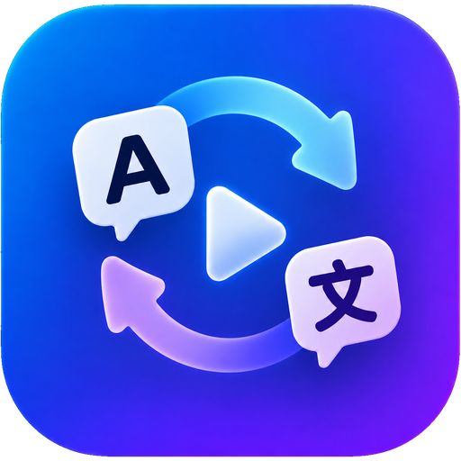
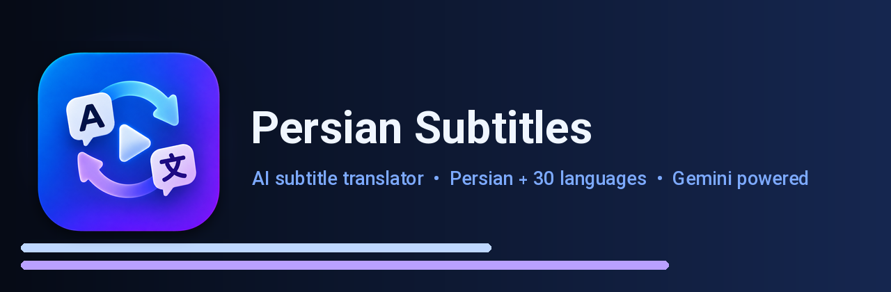

<div align="center">



# Persian Subtitles

**ترجمهٔ حرفه‌ای زیرنویس به فارسی و ۳۰ زبان دیگر با هوش مصنوعی Gemini**
*Professional subtitle translation into Persian and 30 more languages, powered by Google Gemini*

[](https://github.com/QW-AI-Code/Persian-Subtitles/actions/workflows/android_build.yml)
[](https://github.com/QW-AI-Code/Persian-Subtitles/releases/latest)
[](LICENSE)


[فارسی](#فارسی) · [English](#english)



</div>

---

<div dir="rtl">

## فارسی

**Persian Subtitles** یک اپلیکیشن اندروید کاملاً فارسی و راست‌به‌چپ است که فایل زیرنویس شما را با مدل‌های **رایگان** هوش مصنوعی Gemini به فارسی روان ترجمه می‌کند — و اگر بخواهید، با یک لمس روی پرچم کشور، به **۳۰ زبان دیگر** هم. تمام کار روی خود گوشی انجام می‌شود؛ هیچ سرور واسطی وجود ندارد و کلید API شما از دستگاه بیرون نمی‌رود.

### چرا این اپ؟

| ویژگی | توضیح |
|---|---|
| 🌍 **ترجمه به ۳۱ زبان با پرچم کشورها** | پیش‌فرض فارسی است، اما از تب ترجمه با یک لمس روی پرچم می‌توانید زبان مقصد را عوض کنید: انگلیسی، عربی، ترکی، آلمانی، فرانسوی، اسپانیایی، ایتالیایی، پرتغالی، روسی، اوکراینی، چینی، ژاپنی، کره‌ای، هندی، اردو، پشتو، تاجیکی، آذربایجانی، هلندی، لهستانی، سوئدی، چکی، رومانیایی، یونانی، عبری، اندونزیایی، مالایی، ویتنامی، تایلندی و بنگالی. فهرست کامل با جست‌وجو (به فارسی، انگلیسی یا نام بومی زبان) در دسترس است. |
| 🧠 **رفتار درست برای هر زبان** | پرامپت، بازبینی، اصلاح نگارشی و خروجی خودشان را با زبان مقصد تطبیق می‌دهند: قواعد مخصوص فارسی (ي→ی، نیم‌فاصله) فقط روی فارسی اجرا می‌شوند و متن عربی/اردو را خراب نمی‌کنند؛ نشانه‌های راست‌به‌چپ و علائم «،؛؟» فقط برای زبان‌های راست‌به‌چپ و هم‌خط فارسی؛ و آستانهٔ «ترجمهٔ ناقص» برای چینی، ژاپنی و کره‌ای جداگانه تنظیم شده است. |
| 🛡️ **تشخیص پاسخ به زبان اشتباه** | اگر مدل به‌جای زبان مقصد (مثلاً آلمانی) به فارسی جواب بدهد، آن خط خودکار شناسایی و در بازبینی دوباره ترجمه می‌شود. |
| 🔁 **تغییر امن زبان** | عوض کردن زبانِ فایلی که ترجمه دارد، اول تأیید می‌گیرد؛ بعد ترجمه‌های زبان قبلی و شناخت اثر پاک می‌شوند تا دو زبان در یک فایل قاطی نشوند (زیرنویس، زمان‌بندی و علامت تبلیغ‌ها حفظ می‌شود). حین اجرای ترجمه هم زبان قفل است. |
| ⚡ **ترجمهٔ موازی** | چند دسته هم‌زمان به Gemini فرستاده می‌شود؛ یک زیرنویس ۱۵۰۰ خطی در چند دقیقه ترجمه می‌شود، نه نیم‌ساعت. |
| 🎯 **تنظیم خودکار سرعت** | اگر به سهمیهٔ رایگان برخورد کنیم، تعداد درخواست‌های هم‌زمان خودکار نصف و بعد دوباره زیاد می‌شود. ترجمه هرگز متوقف نمی‌شود. |
| 📖 **مطالعهٔ کل زیرنویس پیش از ترجمه** | هوش مصنوعی اول کل فایل را می‌خواند و داستان، شخصیت‌ها، معادل فارسی نام‌ها، لحن و سطح خطاب (تو/شما) را مشخص می‌کند؛ همین شناخت به همهٔ دسته‌ها داده می‌شود تا کل فایل یکدست بماند. |
| 🎭 **لحن هوشمند (انتخاب خودکار لحن)** | وقتی هوش مصنوعی کل زیرنویس را خواند و موضوع و فضای اثر دستش آمد، خودش مناسب‌ترین لحن را از میان ۱۰ لحن آماده انتخاب می‌کند و در تب سبک تنظیم می‌کند — همراه با یک جملهٔ کوتاه که چرا این لحن را برگزیده. همان اجرای ترجمه از اولین دسته با لحن جدید پیش می‌رود، لحن انتخاب‌شده با نشان «انتخاب هوش مصنوعی» مشخص است و شما همیشه می‌توانید دستی عوضش کنید. در حالت «فقط پرامپت اختصاصی من» دست به تنظیم شما نمی‌زند و قابل خاموش‌کردن است. |
| 📚 **واژه‌نامهٔ اختصاصی** | معادل‌های ثابت خودتان را یک بار بنویسید (`Winterfell = وینترفل`)؛ این فهرست به همهٔ درخواست‌ها و مرحلهٔ اصلاح نگارشی فرستاده می‌شود و بر معادل‌هایی که هوش مصنوعی خودش پیشنهاد داده مقدم است. جداکننده‌های `=`، `=>`، `→` و `:` پذیرفته می‌شوند. |
| ⏱️ **همگام‌سازی زمان** | زیرنویسی که زودتر یا دیرتر از صدای فیلم است را با دکمه‌های ±۰٫۱ و ±۱ ثانیه در فایل خروجی جابه‌جا کنید؛ زمان‌بندی خود پروژه دست‌نخورده می‌ماند و با یک لمس صفر می‌شود. |
| 📈 **سرعت و زمان باقی‌مانده** | حین ترجمه می‌بینید چند خط در دقیقه ترجمه می‌شود و حدوداً چقدر تا پایان مانده؛ سرعت روی بازهٔ اخیر حساب می‌شود تا شروع آهسته یا یک توقف سهمیه تخمین را خراب نکند. |
| 🔄 **ادامه از همان‌جا** | قطع اینترنت، بستن برنامه یا کشته‌شدن پروسه توسط اندروید؟ هر دسته بلافاصله در دیتابیس ذخیره می‌شود و کار از همان خط ادامه می‌یابد — نه از اول. |
| 🔍 **بازبینی نهایی** | پس از اتمام، کل زیرنویس بازبینی و خطوط ناقص، بریده یا ترجمه‌نشده خودکار تکمیل می‌شوند. |
| 🧹 **اسکن و اصلاح نگارشی** | در پایان کار — یا با یک دکمه، هر وقت خواستید — کل متن فارسی ویراستاری می‌شود: حروف عربی (ك/ي)، نیم‌فاصله، فاصله‌گذاری علائم و ارقام روی خود گوشی و بدون مصرف سهمیه اصلاح می‌شوند؛ و خطوطی که کلمهٔ انگلیسی ترجمه‌نشده، حرف لاتین جامانده، کلمهٔ تکراری یا جملهٔ ناقص دارند دوباره به هوش مصنوعی سپرده می‌شوند. خطوطی که خودتان ویرایش کرده‌اید دست‌نخورده می‌مانند. |
| 🎨 **۱۰ پریست لحن** | روان، دقیق، محاوره‌ای، سینمایی، رسمی، کمدی، مستند، انیمه، جنایی، ساده. |
| ✍️ **پرامپت اختصاصی شما** | دستور خودتان را بنویسید — یا کنار پریست‌ها، یا با یک دکمه **فقط همین پرامپت** پایهٔ سبک ترجمه باشد و لحن‌های آماده کاملاً کنار گذاشته شوند. |
| ✏️ **ویرایش خط‌به‌خط** | هر خط را دستی اصلاح کنید یا فقط همان یک خط را دوباره به هوش مصنوعی بسپارید؛ جست‌وجو در متن اصلی و ترجمه، به‌همراه فیلتر ترجمه‌نشده / نیازمند بررسی / ویرایش‌شده / تبلیغاتی با شمارندهٔ هر کدام. |
| 🚫 **حذف تبلیغ و کپی‌رایت** | تشخیص خودکار خطوط تبلیغاتی با الگوهای قابل ویرایش؛ حالت ایمن «فقط ابتدا و انتهای فایل». |
| ✒️ **امضای هوشمند مترجم** | متن شما (پیش‌فرض `QW-AI-Code`) به تعداد دلخواه ۱ تا ۱۵ در طول زیرنویس پخش می‌شود، فقط در بازه‌های بدون دیالوگ و بدون جابه‌جا شدن زمان‌بندی هیچ خطی. |
| 🏷️ **۱۴ قالب آمادهٔ امضا** | قالب‌هایی در همان سبک زیرنویس‌های حرفه‌ای — ستاره‌دار، گیومه‌ای، خط تزئینی، دوخطی و… نام شما در قالب قرار می‌گیرد، پیش‌نمایشش را می‌بینید و باز هم قابل ویرایش است. |
| ↔️ **متن ترکیبی فارسی/انگلیسی** | جهت هر خط از خود متن گرفته می‌شود: فارسی راست‌چین، انگلیسی چپ‌چین، و علائم نگارشی سر جایشان — هم در فیلدهای ورودی، هم در ویرایشگر، هم در فایل خروجی. |
| 🧭 **جهت متن قابل انتخاب در خروجی** | چهار حالت نشانه‌گذاری راست‌به‌چپ، چون پخش‌کننده‌ها در پشتیبانی از جهت متن یکسان نیستند: هوشمند (پیشنهادی)، استاندارد یونیکد، قالب صریح، و بدون نشانه. |
| 📄 **خروجی استاندارد** | SRT، WebVTT (با بلوک `STYLE` راست‌به‌چپ برای زبان‌های راست‌به‌چپ)، SRT دوزبانه و متن ساده — با BOM که در همهٔ پخش‌کننده‌ها درست نمایش داده شود. نام فایل خروجی کد زبان را دارد: `movie.fa.srt`، `movie.de.srt`، `movie.ja.vtt`. |
| 🌙 **تم سرمه‌ای تاریک** | طراحی Material 3 با فونت وزیرمتن؛ هر بخش در تب مستقل خودش، بدون هیچ همپوشانی. صفحهٔ «درباره» با هدر گرادیانی هم‌رنگ آیکون، آمار کلیدی و فهرست امکانات آیکون‌دار. |
| 🖼️ **آیکون استاندارد اندروید** | آیکون adaptive تمام‌قد (لایه‌های ۱۰۸dp، نمادها داخل ناحیهٔ امن ۶۶dp) که هر قالب لانچری — دایره، اسکوئرکل، مربع گرد — را کامل پر می‌کند؛ به‌همراه آیکون تک‌رنگ themed، نسخه‌های legacy برای اندروید ۷، آیکون اعلان و نسخهٔ ۵۱۲ پیکسلی Play Store. |

### نصب

آخرین نسخه را از [**صفحهٔ Releases**](https://github.com/QW-AI-Code/Persian-Subtitles/releases/latest) دانلود کنید. سه فایل APK جدا منتشر می‌شود:

> انتشار خودکار است: هر push روی شاخهٔ `main` سه APK را با عنوان
> **Persian Subtitles v1.0.0** روی صفحهٔ Releases می‌گذارد. راهنما:
> [`docs/RELEASING.md`](docs/RELEASING.md).

| فایل | برای چه گوشی‌ای؟ |
|---|---|
| `Persian-Subtitles-vx.y.z-arm64-v8a.apk` | تقریباً همهٔ گوشی‌های امروزی (۶۴ بیتی) — **پیشنهاد ما**، کم‌حجم‌ترین |
| `Persian-Subtitles-vx.y.z-armeabi-v7a.apk` | گوشی‌های قدیمی‌تر ۳۲ بیتی |
| `Persian-Subtitles-vx.y.z-universal.apk` | اگر مطمئن نیستید — روی همه کار می‌کند |

حداقل اندروید ۷٫۰ (API 24).

> **رابط** برنامه **فقط فارسی** است (زبان ترجمه قابل انتخاب است) و این به زبان گوشی بستگی ندارد: هیچ منبع انگلیسی در بسته نیست
> و زبان و جهت راست‌به‌چپ در سطح `Application` و `Activity` تحمیل می‌شود.

### گرفتن کلید API رایگان

۱. به [Google AI Studio](https://aistudio.google.com/apikey) بروید و با حساب گوگل وارد شوید.
۲. روی **Create API key** بزنید و کلید را کپی کنید.
۳. در اپ به تب **تنظیمات** بروید، کلید را بچسبانید و **تست کلید API** را بزنید.
۴. اپ فهرست مدل‌ها را می‌گیرد و **فقط مدل‌های زیر** را نشان می‌دهد؛ یکی را انتخاب کنید.

| مدل | توضیح |
|---|---|
| `gemini-3.1-flash-lite` | **پیش‌فرض** — بیشترین سهمیهٔ رایگان؛ دیرتر از همه به سقف محدودیت می‌رسد |
| `gemini-3.8-flash` | بهترین کیفیت ترجمه؛ سهمیهٔ رایگان کم و زود به سقف می‌رسد |
| `gemini-3.5-flash-lite` | سریع و سبک؛ سهمیهٔ رایگان متوسط |
| `gemini-3.1-flash-lite-preview` | نسخهٔ پیش‌نمایش؛ ممکن است بدون اطلاع تغییر کند |
| `gemini-flash-lite-latest` | همیشه به آخرین نسخهٔ Flash-Lite وصل می‌شود |

این فهرست یک allow-list سختگیرانه است: هر مدل دیگری که API برگرداند نمایش داده نمی‌شود.
برای تغییر آن فقط `FreeModelCatalog.ALLOWED` را ویرایش کنید.

> کلید و زیرنویس‌های شما فقط در حافظهٔ خود گوشی ذخیره می‌شوند.

### روش استفاده

۱. **تب ترجمه** → «انتخاب فایل زیرنویس» (`.srt` یا `.vtt`). می‌توانید فایل را از فایل‌منیجر هم با این اپ باز کنید.
   در همین تب، در کارت **«زبان مقصد ترجمه»** زبان را انتخاب کنید: پیش‌فرض 🇮🇷 فارسی است؛ روی یکی از پرچم‌های پرکاربرد بزنید یا «همهٔ زبان‌ها» را باز کنید و جست‌وجو کنید.
۲. **تب سبک** → «تشخیص خودکار لحن» را روشن بگذارید تا هوش مصنوعی بعد از مطالعهٔ زیرنویس لحن را خودش انتخاب کند، یا لحن دلخواه را دستی بزنید، یا پرامپت خودتان را بنویسید و گزینهٔ «فقط پرامپت اختصاصی من» را بزنید. معادل‌های ثابت را هم در «واژه‌نامهٔ اختصاصی» بنویسید.
۳. **تب کپی‌رایت** → اگر لازم است، حذف خطوط تبلیغاتی را تنظیم کنید و امضای خود را از میان قالب‌های آماده انتخاب کنید.
۴. **تب ترجمه** → «شروع ترجمه». می‌توانید اپ را ببندید؛ کار در پس‌زمینه با اعلان پیشرفت ادامه می‌یابد.
۵. **تب ویرایش** → خطوط را با جست‌وجو و فیلتر بازبینی و اصلاح کنید. در پایان ترجمه، اسکن و اصلاح نگارشی خودکار انجام می‌شود و هر وقت خواستید می‌توانید دستی هم اجرایش کنید.
۶. **تب ترجمه** → اگر لازم است زمان زیرنویس را در «همگام‌سازی زمان» جابه‌جا کنید و خروجی SRT یا VTT را ذخیره کنید.

### تنظیم سرعت

در تب **تنظیمات** → بخش «سرعت ترجمه»:

- **درخواست‌های هم‌زمان (۱ تا ۸)** — موتور موازی. پیش‌فرض ۴. عدد بالاتر = سریع‌تر، اما زودتر به سهمیهٔ رایگان می‌رسید (که خود اپ مدیریتش می‌کند).
- **تعداد خط در هر درخواست (۵ تا ۵۰)** — پیش‌فرض ۲۰. دسته‌های بزرگ‌تر سریع‌تر و یکدست‌ترند.

با تنظیم پیش‌فرض، حدود **۸۰ خط در هر دور** ترجمه می‌شود.

### میزان مصرف توکن

در تب **تنظیمات** → بخش «میزان مصرف توکن API جمینای»، برای هر مدل مصرف امروز (درخواست‌ها و توکن ورودی/خروجی/تفکر) و مصرف یک دقیقهٔ اخیر نمایش داده می‌شود. اعداد از `usageMetadata` پاسخ خود سرور جمینای خوانده می‌شوند. چون گوگل برای کلید API راهی برای خواندن مستقیم سهمیهٔ باقی‌مانده ندارد، سقف هر مدل از پیام خطای ۴۲۹ خود گوگل خوانده می‌شود یا کاربر آن را دستی وارد می‌کند. آمار رسمی کامل در Google AI Studio است.

### ساخت از سورس

```bash
git clone https://github.com/QW-AI-Code/Persian-Subtitles.git
cd Persian-Subtitles
./gradlew assembleRelease
```

سه APK در `app/build/outputs/apk/release/` ساخته می‌شود. برای امضا با کلید خودتان، فایل `keystore.properties` را در ریشهٔ پروژه بسازید:

```properties
storeFile=/path/to/release.keystore
storePassword=...
keyAlias=...
keyPassword=...
```

### معماری

```
data/db          Room — هر دسته بلافاصله ذخیره می‌شود (پایهٔ قابلیت ادامه)
data/prefs       DataStore — تنظیمات و کلید API
data/repo        هم‌بندی ورود فایل، خروجی و کنترل اجرا
domain/subtitle  خواندن/نوشتن SRT و VTT، حذف تبلیغ، امضا و قالب‌هایش، ساخت خروجی
domain/lang      فهرست زبان‌های مقصد، پرچم‌ها و ویژگی خط هر زبان (جهت، علائم، فشردگی)
domain/text      جهت متن راست‌به‌چپ و نرمال‌سازی نگارش فارسی
domain/quality   تشخیص ایرادهای ویرایشی خطوط ترجمه‌شده
domain/ai        مطالعهٔ کل زیرنویس، ساخت «شناخت اثر» و انتخاب خودکار لحن
domain/prompt    پریست‌های لحن، واژه‌نامهٔ اختصاصی، حالت پرامپت اختصاصی و ساخت پرامپت
domain/progress  محاسبهٔ سرعت ترجمه و زمان باقی‌مانده
network          کلاینت REST جمینای + فیلتر مدل‌های رایگان
work             موتور ترجمهٔ موازی، بازبینی و اصلاح نگارشی + Worker پیش‌زمینه‌ای
ui               Jetpack Compose، Material 3، RTL، ۵ تب + درباره
```

### تست‌ها

۲۱۰ تست واحد روی منطق حساس پروژه: پارسر SRT/VTT (BOM، CRLF، شماره‌های جاافتاده، تنظیمات VTT)، سازندهٔ خروجی، تشخیص کپی‌رایت (هم مثبت و هم منفی)، پارسر پاسخ مدل (code fence، کلیدهای جایگزین، متن خراب)، فیلتر مدل‌های رایگان، رفتار برنامه وقتی Gemini یک دیالوگ را رد می‌کند (خاموش بودن فیلترها در هر درخواست، نصف‌کردن دستهٔ ردشده تا پیدا شدن خط مقصر، رد کردن همان یک خط و ادامهٔ کار)، قواعد جهت متن فارسی/انگلیسی/ترکیبی و نشانه‌گذاری فایل خروجی، نرمال‌سازی نگارش فارسی، تشخیص ایرادهای ویرایشی و اصلاحشان، قالب‌های امضا، جای‌گذاری امضا (نیفتادن روی دیالوگ، پخش‌شدگی در طول فیلم، دست‌نخورده ماندن زمان‌بندی)، و ترجمه به زبان‌های دیگر (دست‌نخورده ماندن پرامپت فارسی، اجرا نشدن قواعد فارسی روی عربی، تشخیص پاسخ فارسی به درخواست آلمانی، نام فایل با کد زبان)، انتخاب خودکار لحن (اعمال فقط پس از مطالعهٔ تازه، استفاده در همان اجرا، دست نزدن به پرامپت اختصاصی و رد لحن ناشناخته)، واژه‌نامهٔ اختصاصی، همگام‌سازی زمان خروجی و تخمین زمان باقی‌مانده.

```bash
./gradlew testDebugUnitTest
```

بررسی ایستای منابع هم با یک اسکریپت انجام می‌شود:

```bash
python3 docs/static-check.py
```

### سازنده

ساخته‌شده توسط **QW-AI-Code** — [github.com/QW-AI-Code](https://github.com/QW-AI-Code)

فونت: [وزیرمتن](https://github.com/rastikerdar/vazirmatn) (SIL OFL 1.1)

</div>

---

## English

**Persian Subtitles** is a fully right-to-left Android app that translates subtitle files into fluent Persian using the **free** tier of Google's Gemini models — or, with one tap on a country flag, into **30 other languages**. Everything runs on the device — there is no backend, and your API key never leaves the phone.

### Highlights

| Feature | Details |
|---|---|
| 🌍 **31 target languages, picked by flag** | Persian is the default; the translate tab switches the target with one tap on a flag: English, Arabic, Turkish, German, French, Spanish, Italian, Portuguese, Russian, Ukrainian, Chinese, Japanese, Korean, Hindi, Urdu, Pashto, Tajik, Azerbaijani, Dutch, Polish, Swedish, Czech, Romanian, Greek, Hebrew, Indonesian, Malay, Vietnamese, Thai and Bengali. The full list is searchable by Persian, English or native name. |
| 🧠 **Language-aware pipeline** | Prompt, review, editorial scan and export all follow the target: the Persian-only rules (`ي`→`ی`, ZWNJ) run on Persian only and never damage Arabic or Urdu, RTL marks and `،؛؟` are applied only to RTL / Arabic-script languages, and the "truncated" threshold is relaxed for Chinese, Japanese and Korean. |
| 🛡️ **Wrong-language detection** | When the model answers in Persian although the target is, say, German, the line is detected and re-translated in the review pass. |
| 🔁 **Safe language switch** | Changing the language of a file that already has translations asks first, then clears the old-language lines and the film brief so two languages never mix (cues, timings and ad flags stay). The language is locked while a run is in progress. |
| ⚡ **Parallel translation** | Several batches are in flight at once — a 1500-line subtitle finishes in minutes instead of half an hour. |
| 🎯 **Adaptive throttling** | When the free quota answers "slow down", the number of parallel requests halves and then ramps back up. Translation never dies. |
| 📖 **Reads the whole subtitle first** | One request before the translation starts works out the plot, the characters, the Persian spelling of their names, the tone and the level of address. Every batch gets that brief, so the whole file stays consistent. |
| 🎭 **Automatic tone** | Once the AI has read the whole subtitle and understood what the film is about, it picks the best of the 10 tone presets itself and switches the Style tab to it — with a one-line reason. The same run translates its very first batch in that tone, the choice carries an "AI pick" badge, and you can always overrule it. It never touches the "only my own prompt" mode and can be switched off. |
| 📚 **Personal glossary** | Write your fixed terms once (`Winterfell = وینترفل`); the list is sent with every batch and with the editorial pass, and ranks above the equivalents the model came up with. `=`, `=>`, `→` and `:` all work as separators. |
| ⏱️ **Timing sync** | A subtitle that runs early or late against the video is shifted in the exported file with ±0.1 s / ±1 s buttons; the project's own timings stay untouched and one tap resets the offset. |
| 📈 **Speed and time left** | While translating you see lines per minute and roughly how long is left; the speed is measured over a recent window, so the slow ramp-up or a quota pause does not skew it. |
| 🔄 **Truly resumable** | Every batch is committed to the database immediately, so a lost connection, a closed app or a killed process continues from the next untranslated line. |
| 🔍 **Final review pass** | After the run, the whole subtitle is checked and incomplete, truncated or untranslated lines are redone. |
| 🧹 **Editorial scan** | At the end of a run — or on demand — the Persian text is proofread: Arabic letter shapes, the zero-width non-joiner, punctuation spacing and digits are corrected on the device without spending any quota, and only the lines with a leftover English word, a stray Latin letter, a doubled word or a truncated sentence go back to the model. Lines you edited by hand are never touched. |
| 🎨 **10 tone presets** | Fluent, literal, colloquial, cinematic, formal, comedy, documentary, anime, crime, simple. |
| ✍️ **Your own prompt** | Write your own instruction — either alongside the presets, or as the *only* style instruction, with the presets switched off completely. |
| ✏️ **Line-by-line editor** | Fix any line by hand, or send just that one line back to the AI; search both the original and the translation, and filter by untranslated / needs review / edited / advertising, each with its own count. |
| 🚫 **Credit/ad stripping** | Editable pattern list, with a safe "only first and last cues" mode. |
| ✒️ **Signature placement** | Your text is spread over the file, 1 to 15 times, only into gaps where no dialogue is on screen — no cue's timing is ever moved. |
| 🏷️ **14 ready-made credit frames** | The shapes professional Persian subtitles use, with your name already in them and a live preview; still fully editable afterwards. |
| ↔️ **Mixed Persian/English text** | Direction comes from the text itself: Persian right-aligned, English left-aligned, punctuation where it belongs — in the input fields, in the editor and in the exported file. |
| 🧭 **Selectable text direction** | Four ways of marking right-to-left in the exported file, because players do not agree on how much of the BiDi algorithm they implement: smart (recommended), Unicode isolates, explicit embedding, or no marks at all. |
| 📄 **Standard output** | SRT, WebVTT (with an RTL `STYLE` block for RTL languages), bilingual SRT and plain text, written with a BOM so every player renders the text correctly. The file name carries the language code: `movie.fa.srt`, `movie.de.srt`, `movie.ja.vtt`. |
| 🌙 **Dark navy theme** | Material 3 with the Vazirmatn typeface; each area lives in its own tab, nothing overlaps. The About page has a gradient hero in the icon's colours, headline numbers and an icon-led feature list. |
| 🖼️ **Standard Android icon** | A full-bleed adaptive icon (108 dp layers, glyphs inside the 66 dp safe zone) that fills every launcher mask — circle, squircle, rounded square — plus a themed monochrome layer, legacy icons for Android 7, a notification icon and the 512 px Play Store icon. |

### Install

Grab the latest build from the [**Releases page**](https://github.com/QW-AI-Code/Persian-Subtitles/releases/latest). Three separate APKs are published:

> Publishing is automatic: every push to `main` attaches three APKs to the
> Releases page under the title **Persian Subtitles v1.0.0**. See
> [`docs/RELEASING.md`](docs/RELEASING.md).

| File | Use it when |
|---|---|
| `Persian-Subtitles-vx.y.z-arm64-v8a.apk` | Any modern 64-bit phone — **recommended**, smallest download |
| `Persian-Subtitles-vx.y.z-armeabi-v7a.apk` | Older 32-bit devices |
| `Persian-Subtitles-vx.y.z-universal.apk` | When in doubt — runs everywhere |

Requires Android 7.0 (API 24) or newer.

> The **UI** is **Persian only** (the translation language is selectable) and does not follow the phone's language: no English
> resources are shipped, and the locale plus RTL layout are forced in `Application`
> and `Activity`.

Only these models are offered (a strict allow-list in `FreeModelCatalog.ALLOWED`):
`gemini-3.1-flash-lite` (default, largest free quota), `gemini-3.8-flash`, `gemini-3.5-flash-lite`,
`gemini-3.1-flash-lite-preview`, `gemini-flash-lite-latest`.

### Get a free API key

1. Open [Google AI Studio](https://aistudio.google.com/apikey) and sign in.
2. Click **Create API key** and copy it.
3. In the app, go to the **Settings** tab, paste the key and tap **Test API key**.
4. The app fetches the model list and shows **only the free models** your key can use.

### Choosing the target language

On the **Translate** tab, the **Target language** card shows the current language with
its flag. Tap one of the quick flags (🇮🇷 🇬🇧 🇸🇦 🇹🇷 🇩🇪 🇫🇷 🇪🇸 🇷🇺) or open **All languages**
to search the full list of 31. The choice is saved and used for every later run.

### Tone, glossary and sync

- **Style → Smart tone:** leave *Automatic tone* on and the AI chooses the tone after reading the subtitle; the chosen preset is marked *AI pick* and can be changed by hand at any time.
- **Style → Personal glossary:** one term per line, `source = translation`.
- **Translate → Output → Timing sync:** shift the exported file earlier or later against the video.

### Build from source

```bash
git clone https://github.com/QW-AI-Code/Persian-Subtitles.git
cd Persian-Subtitles
./gradlew assembleRelease
```

The three APKs land in `app/build/outputs/apk/release/`. To sign with your own key, create `keystore.properties` in the project root (`storeFile`, `storePassword`, `keyAlias`, `keyPassword`).

### Releasing

Push a tag and the workflow builds, signs and publishes all three APKs plus `SHA256SUMS.txt`:

```bash
git tag v1.0.0
git push origin v1.0.0
```

Optional repository secrets for release signing: `KEYSTORE_BASE64`, `KEYSTORE_PASSWORD`, `KEY_ALIAS`, `KEY_PASSWORD`.

### Tests

210 unit tests cover the logic that actually breaks on real files: the SRT/VTT parser
(BOM, CRLF, missing cue numbers, VTT cue settings), the exporter, credit detection
(both the hits and the false positives), the model-answer parser (code fences,
alternative key names, garbage), the free-model filter, what happens when Gemini
refuses a line, the bidirectional text rules for mixed Persian/English and the marks
written into the exported file, Persian spelling normalisation, the editorial scan
that decides which lines still need the model, the credit frames, and where the
signature may be placed (never on top of dialogue, spread over the running time,
dialogue timings untouched), and translation into other languages (Persian prompt
unchanged, Persian rules never applied to Arabic, a Persian answer to a German request
caught, language code in the file name), automatic tone (applied only after a fresh
reading, used by the same run, never overriding a custom-only prompt, unknown tones
rejected), the personal glossary, the export timing shift and the time-left estimate.

### Performance

The release build ships a baseline profile (`app/src/main/baseline-prof.txt`, applied
by `profileinstaller`), so the Compose UI is AOT-compiled at install time instead of
being interpreted on the first launches — that was the main reason scrolling stuttered.
R8 runs in full mode and `compose_compiler_config.conf` marks the collection types
stable so the tabs stay skippable.

```bash
./gradlew testDebugUnitTest     # unit tests
python3 docs/static-check.py    # static resource check
```

### Tech stack

Kotlin · Jetpack Compose · Material 3 · Room · DataStore · WorkManager · OkHttp · kotlinx.serialization

### License

[MIT](LICENSE) © **QW-AI-Code** — [github.com/QW-AI-Code](https://github.com/QW-AI-Code)

Font: [Vazirmatn](https://github.com/rastikerdar/vazirmatn), SIL Open Font License 1.1.
